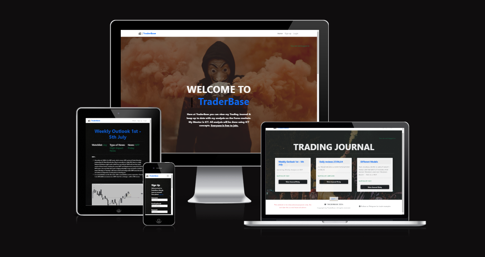
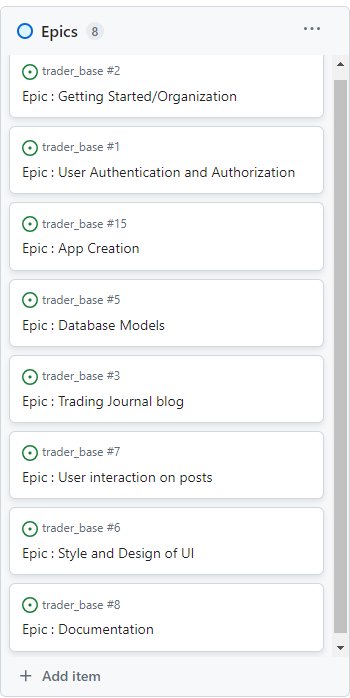
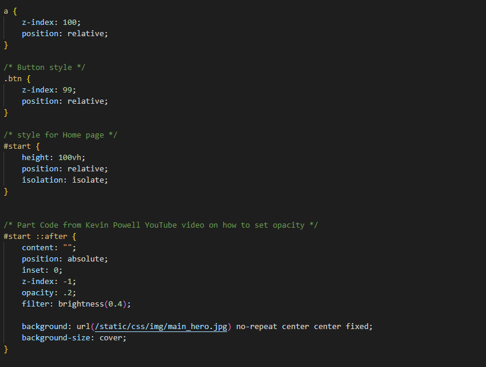
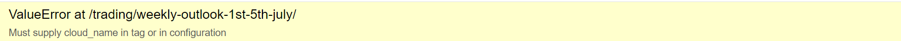

# ***TraderBase - Colin Breakell - Portfolio Project 4***

- TraderBase is a website for Forex traders who would like to follow along with a Funded ICT Trader. I decided to make this website for all ICT traders out there who would like to gain information and knowledge, while following my journey via a Journal blog. In my Journal I will be providing daily and weekly analysis. (ICT trading is a style of trading from a trader called ICT) Each blog post will contain chart examples and text explaining what my thought proccess is for each day and each week. I will be showing trade examples, useful information, and trading models for users who signup. I wanted to give a 'Money Heist' vibe to my website beacuse I believe trading is like a money heist. We are entering the market ready to start a heist and take money out of the market for ourselves.




# **2. Table of content**

# **3. User Experience (UX)**

## **3.1. The Strategy Plane**

### **3.1.1 The Idea**
The idea for TraderBase is simple. I wanted a website that allowed like minded Traders to be able to view my analysis for free. A place for ICT traders to learn some trading education and to compare there analysis to mine. My idea was for me to post Journal entries - these Journal entries would involve weekly, and daily analsyis. People can sign up and view my Journal entires and hopefully learn something!

### **3.1.2 The Ideal User**
My target audience is like minded traders.

- Ideal user likes Forex Trading 
- Ideal user like Indices trading
- Ideal user likes ICT style of content and analysis


### **3.1.3 Site Goals**
- Offer users the ability to learn from my analysis 
- Allow users to view my Journal entries in a clear and easy to read way
- Allow users to ask questions via a comment section


### **3.1.4 Epics**
After thinking about my project, 8 Epics were created for this project. These Epics were the main sections of the TraderBase project. You can view the Epics via the KanBan board for this project. The Epics consisted of :

- EPIC 1 : Getting started/Organization
- EPIC 2 : User Authentication and Authorization
- EPIC 3 : App Creation
- EPIC 4 : Database Models
- EPIC 5 : Trading Journal 
- EPIC 6 : User Interaction on Posts 
- EPIC 7 : Style and Design of UI
- EPIC 8 : Documentation


 - 

### **3.1.5 User stories**

I had a total of 31 User Stoires for this project. I categorized them via Must-Have -- Should-have -- Could have -- & Wont have.
Must haves were Crucial for this project. Should-haves were I should have this but it is not the end of the world if I do not. Could haves were if I thought something could be in my project, It would be nice to have it but it does not need it. Wont haves were user stories that I wont have in my project due to time restraints or the skills to be able to do it as of now.

**MoSCoW prioritization technique stands for**:

**Must-Have**: Critical requirements that must be implemented for the project to be considered successful.

**Should-Have**: Important requirements that are not critical but add significant value.

**Could-Haves**: Desirable features that would be nice to have but are not crucial.

**Won't-Have**: Features that are explicitly excluded from the project scope.

### List of user stories sorted by Epic :

<details>
<summary>
View User Stories for EPIC 1 : Getting started/Organization
</summary>

| Issue                                                               | Title                                  | User Story                                                                                                                 |
| ------------------------------------------------------------------- | -------------------------------------- | -------------------------------------------------------------------------------------------------------------------------- |
| [# 1](https://github.com/BreakellrZ/trader_base/issues/12) | User Story - Setting up my Github Repoistory   | As a Developer I can setup a github Repository so that I can push all my work to it from my IDE and have the use of a KanBan Board.      |
| [# 2](https://github.com/BreakellrZ/trader_base/issues/13) | User Story - Creating my Django project | As a Developer I can create a Django project in my IDE so that I can start my pp4 project.  |
| [# 3](https://github.com/BreakellrZ/trader_base/issues/17) | User Story - Deploy and set up to Heroku |  As a Developer I can setup heroku so that I can deploy my project on Heroku |
| [# 4](https://github.com/BreakellrZ/trader_base/issues/30) | User Story - Deploy and set up to Heroku |  As a Developer I can setup heroku so that I can deploy my project on Heroku |

</details>


<details>
<summary>
View User Stories for EPIC 2 : User Authorization and Authentication
</summary>

| Issue                                                               | Title                                  | User Story                                                                                                                 |
| ------------------------------------------------------------------- | -------------------------------------- | -------------------------------------------------------------------------------------------------------------------------- |
| [# 5](https://github.com/BreakellrZ/trader_base/issues/9) | User Story - Register    | As a Site User I am able to register to create a new account and to be able to select a username and passsword.      |
| [# 6](https://github.com/BreakellrZ/trader_base/issues/10) | User Story - Login | As a Site User I am able to Log in to see registerd user sections. |
| [# 7](https://github.com/BreakellrZ/trader_base/issues/11) | User Story - Logout | As a Site User, I can Log out so that I am no longer Logged in. |
| [# 8](https://github.com/BreakellrZ/trader_base/issues/21) | User Story - Create Superuser |  As a developer, I can create a superuser so that I can control and view my database. |
| [# 9](https://github.com/BreakellrZ/trader_base/issues/35) | User Story - Journal page can only be seen if user is logged in |  As a developer I can  make it so users only see the Journal page if they sign up  so that it gets people to sign up and gets them to comment on journal posts |
| [# 10](https://github.com/BreakellrZ/trader_base/issues/34) | User Story : User can see if they are logged in or not |  As a user I can see if I am logged in so that I know if I need to log in or not |

</details>

<details>
<summary>
View User Stories for EPIC 3 : App Creation
</summary>

| Issue                                                               | Title                                  | User Story                                                                                                                 |
| ------------------------------------------------------------------- | -------------------------------------- | -------------------------------------------------------------------------------------------------------------------------- |
| [# 11](https://github.com/BreakellrZ/trader_base/issues/14) | User Story - Create Home app | As a Developer I can Create my first django app so that I can use this app for my home page     |
| [# 12](https://github.com/BreakellrZ/trader_base/issues/16) | User Story - Create Trading Blog app | As a Developer I can create a rescource app so that I can use the app for an extra page on my website to display my trading blog/Journal data from my journal database. |

</details>


<details>
<summary>
View User Stories for EPIC 4 : DataBase Models
</summary>

| Issue                                                               | Title                                  | User Story                                                                                                                 |
| ------------------------------------------------------------------- | -------------------------------------- | -------------------------------------------------------------------------------------------------------------------------- |
| [# 13](https://github.com/BreakellrZ/trader_base/issues/19) | User Story : Create database with PostgreSQL | As a Developer I can create a postgre datbase so that I can store my data here.     |
| [# 14](https://github.com/BreakellrZ/trader_base/issues/20) |User Story : Connect PostgreSQL database to code | As a Developer, I can connect my database to my code so that I can store my data to my database. |
| [# 15](https://github.com/BreakellrZ/trader_base/issues/23) | User Story : Create a Journal Model| As a developer I can create a Journal model so that I can log my Journal data into my database |
| [# 16](https://github.com/BreakellrZ/trader_base/issues/24) | User Story : Create a Comment Model| As a Developer I can create a comment datbase model so that Users can comment on Journal blog posts |

</details>

<details>
<summary>
View User Stories for EPIC 5 : Trading Journal 
</summary>

| Issue                                                               | Title                                  | User Story                                                                                                                 |
| ------------------------------------------------------------------- | -------------------------------------- | -------------------------------------------------------------------------------------------------------------------------- |
| [# 17](https://github.com/BreakellrZ/trader_base/issues/32) | User Story : View Post Journal Content | As a user I can view the Journal content so that I can enjoy and read up on the Journal entry. |
| [# 18](https://github.com/BreakellrZ/trader_base/issues/25) | User Story : Create Views for trading_blog app| As a developer I can code my views.py file so that I can import my models to my views and then see my database via a generic listview on live website. |
| [# 19](https://github.com/BreakellrZ/trader_base/issues/18) | User Story : View paginated list of posts| As a site user, I can view a paginated list of posts so that I can select which post I want to view. |
| [# 20](https://github.com/BreakellrZ/trader_base/issues/29) | User Story : Open a Journal post| As a user I can click on a Journal post so that it opens the post and shows me the posts content |

</details>

<details>
<summary>
View User Stories for EPIC 6 : User Interaction on Posts 
</summary>

| Issue                                                               | Title                                  | User Story                                                                                                                 |
| ------------------------------------------------------------------- | -------------------------------------- | -------------------------------------------------------------------------------------------------------------------------- |
| [# 21](https://github.com/BreakellrZ/trader_base/issues/33) | User Story : User can Create Comments  | As a user I can have crud capabilities so that the user can create, update and delete their comments |
| [# 22](https://github.com/BreakellrZ/trader_base/issues/38) | User Story : User can Update Comments | As a user I can have crud capabilities so that the user can create their comments |
| [# 23](https://github.com/BreakellrZ/trader_base/issues/39) | User Story : User can Delete Comments | As a user I can have crud capabilities so that the user can delete their comments |

</details>

<details>
<summary>
View User Stories for EPIC 7 : Style and Design of UI 
</summary>

| Issue                                                               | Title                                  | User Story                                                                                                                 |
| ------------------------------------------------------------------- | -------------------------------------- | -------------------------------------------------------------------------------------------------------------------------- |
| [# 24](https://github.com/BreakellrZ/trader_base/issues/27) | User Story : Design Home page with Bootstrap | As a developer I can design the home page nicely so that the users can enjoy a nice UI and understand what the website is all about |
| [# 25](https://github.com/BreakellrZ/trader_base/issues/28) | User Story : Design Journal page with Bootstrap|As a developer I can style the Journal page so that the users will have a nice Journal page to look at |
| [# 26](https://github.com/BreakellrZ/trader_base/issues/37) | User Story : Custom Styling using CSS | As a developer I can use css so that I can use custom styles for my project |
| [# 27](https://github.com/BreakellrZ/trader_base/issues/26) | User Story : Admin Panel Power Up | As a developer I can download summernote so that superusers have a better layout and format on the admin page. |

</details>

<details>
<summary>
View User Stories for EPIC 8 : Documentation
</summary>

| Issue                                                               | Title                                  | User Story                                                                                                                 |
| ------------------------------------------------------------------- | -------------------------------------- | -------------------------------------------------------------------------------------------------------------------------- |
| [# 28](https://github.com/BreakellrZ/trader_base/issues/40) | User Story : Document everything I can | As a developer I can document everything so that users can see what TraderBase is about & get a deeper insight into the making of TraderBase |

</details>

---


## **3.2. The Scope Plane**

The scope plans contained the following features to be added.

### 3.2.1. Features to be implemented

- **User Authentication** : Users can Register, Login and Logout.

- **User Interaction for comments** : Users can interact with Journal entries via Comments.

- **User Interaction via likes/dislikes** : Users can like or dislike each Journal entry post.

- **FAQ** : Users can view the FAQ accordian for answers to the most asked questions about TraderBase.

- **Notifications** : Users will be notified if they have commented on a post, deleted a post, updated a post & they will be able to see if they are logged in or not.


## **3.3. The Structure Plane**

**The structure of TraderBase is consistent, predictable, learnable, and visible, all in the best way using Bootstrap for styling and layout.**
It involves a clean header at the top of the page with the TraderBase logo to the left and the navbar links to the right. The footer is at the bottom of the page, it is clean, provoding users with a Telegram link for more trades from me, and also a disclamier to users that all content shown is not financial advice.

Then on the Home page we have a lovely hero image with text filling up the full screen. As the user scrools down there is another two sections, one with cards showcasing what the users can expect from TraderBase, and the last section is a FAQ area.

On the Journal page, we have the same Header and footer. The main section then involves a hero image and my Journal entry blog posts via cards. These cards are evenly spaced out and there is a Next and Previous buttons to press to go through the Journal entires. These buttons are structured just below the cards.

Inside the journal entries we have the title shown, then under we have the watchlists and news events for this Journal entry, below that we have the main post content and then a comment section for users to interact with the posts. Comments are shown on the left while the comment form is structured on the right. Header and Footer are the same on all pages.

The headers structure changes based on if the user is logged in or not. If logged in it will show 'JOURNAL' & 'LOGOUT'. If not logged in it will show 'LOGIN' & 'REGISTER'.

### **DataBse Schemas** ###
NEED TO DO LUCIDCHART


## **3.4. The Skeleton Plane**

### 3.4.1. Wire-frames


## **3.5. The Surface Plane**


[Back to top]()

---

# **4. Features**


## **4.1. Future Features**


[Back to top]()

---

# **5. Validation, Testing & Bugs**

## **5.1. Validation**
- Pep 8 CI Validator tests: 

| Directory      | File            | Result                                                   |
| -------------- | --------------- | -------------------------------------------------------- |
| pp4_project    | \`settings.py\` | <span style="color:red;">Fail (Line to long line 122)</span>|
| pp4_project    | \`urls.py\`     | <span style="color:green;">PASS</span>                   |
| pp4_project    | \`init.py\`     | <span style="color:green;">PASS</span>                   |
| pp4_project    | \`asgi.py\`     | <span style="color:green;">PASS</span>                   |
| pp4_project    | \`wsgi.py\`     | <span style="color:green;">PASS</span>                   |
| trading_blog   | \`urls.py\`     | <span style="color:green;">PASS</span>                   |
| trading_blog   | \`views.py\`    | <span style="color:green;">PASS</span>                   |
| trading_blog   | \`tests.py\`    | <span style="color:green;">PASS</span>                   |
| trading_blog   | \`models.py\`   | <span style="color:green;">PASS</span>                   |
| trading_blog   | \`forms.py\`    | <span style="color:green;">PASS</span>                   |
| trading_blog   | \`apps.py\`     | <span style="color:green;">PASS</span>                   |
| trading_blog   | \`admin.py\`    | <span style="color:green;">PASS</span>                   |
| trading_blog   | \`init.py\`     | <span style="color:green;">PASS</span>                   |
| home           | \`views.py\`    | <span style="color:green;">PASS</span>                   |
| home           | \`urls.py\`     | <span style="color:green;">PASS</span>                   |
| home           | \`tests.py\`    | <span style="color:green;">PASS</span>                   |
| home           | \`models.py\`   | <span style="color:green;">PASS</span>                   |
| home           | \`apps.py\`     | <span style="color:green;">PASS</span>                   |
| home           | \`admin.py\`    | <span style="color:green;">PASS</span>                   |
| home           | \`init.py\`     | <span style="color:green;">PASS</span>                   |

- W3C CSS VALIDAOR : 
No errors found.

- W3C HTML Validator :

- JS Validation 

- Lighthouse scores


## **5.2. Testing**
|Epic|What the test is|How I done the test|Outcome|
|-------------|------------------|-----------|-------|
||||| 
|Getting started/Organization|Tested to see if the deployed project works|Clicked on Heroku live project url.|Works as expected|
|Getting started/Organization|Tested to see if PostgreSQL database was connected to Heroku|Logged in as superuser and Checked admin panel on Heroku live site to see if database was connected successfully|Works as expected|
|Getting started/Organization|Tested if I registered to Cloudinary and is it working as an image hosting provider for superusers.|Uploaded a image to my Journal posts via the admin panel using cloudinary, checked if It was displayed on my post_detail page|Works as expected|
|User Authentication and Authorization|Tested to see if users can register|Try create a new account, entered username and password correctly|Works as expected|
|User Authentication and Authorization|Tested to see if an error pops up when users dont add a username and/or password when registering|Leave out a password and/or username when registering|Works as expected|
|User Authentication and Authorization|Can users Login and does an error show if unsuccessful?|Logged in correctly - then logged in with wrong credentials to see if an error message shows|Works as expected|
|User Authentication and Authorization|Can users logout?|Clicked logout button|Works as expected|
|User Authentication and Authorization|Does the correct links show when Logged in/out|Clicked login button - to see if Journal page shows and logout shows - Then clicked logout to see if Journal page was invisible and login/register links were visible|Works as expected|
|User Authentication and Authorization|Tested to see if users can see if they are logged in or not|Logged in and logged out to see if a message showed that the user is logged in or logged out|Works as expected|
|Trading Blog|Tested to see if user can click each Journal post, and it brings them directly to that post|Clicked on each trading Journal post to see if each post sent me to the correct post_detail page|Works as expected|
|Trading Blog|Tested to see if user can view all Journal posts posted via a paginiated list of posts|Clicked on next & previous buttons on post page to go between the most recent posts to older posts|Works as expected|
|Admin Panel|Tested to see if Superuser can successfully use the admin panel to upload Jounral blog posts |Went to admin panel- clicked on Journals - clicked add Journal - Added content to all neccessary fields and clicked save|Works as expected|
|Admin Panel|Tested to see if Journal blog posts were not uploaded to the journal page if status was set to 'draft' |Went to admin panel - clicked on add Journals - Added content to Journal - Put status as draft - hit save - checked to see if post was uploaded or not to journal page. Post was not uploaded |Works as expected|
|Admin Panel|Tested to see if each part of my Journal model worked and was visible for users to see once published. These include Excerpt, title, and watchlist on post.html Journal page - Title, main content, watchlist, news events,specific news, and images on post_detail.html page|Created new Journal post and included each part of Journal model. Clicked on Journal page and clicked into new post.|Works as expected|
|Admin Panel|Tested to see if Superuser can successfully approve comments made by users |Went to admin panel- clicked on Comments - clicked on each comment - Clicked the approve box to approve the comment - clicked save -  checked comment section on live site to see if comment had been approved|Works as expected|
|User Interaction on posts|Tested to see if users can comment on Journal posts|Clicked into a Journal post, scrolled down to comment section - Typed in a comment and clicked submit|Works as expected|
|User Interaction on posts|Tested to see if users can update their comment on Journal posts|Clicked into a Journal post, scrolled down to comment section - Typed in a comment and clicked submit, then clicked edit button on comment - typed in new comment and clicked update button - comment updated |Works as expected|
|User Interaction on posts|Tested to see if users can delete their comment on Journal posts and if a modal pops up when user clicks delete to confirm deletion|Clicked into a Journal post, scrolled down to comment section - Typed in a comment and clicked submit - Found comment and clicked delete - modal pops up, clicked delete button to confirm deletion |Works as expected|
|User Interaction on posts|Tested to see if text shows when a user deletes a post |Clicked into a Journal post, scrolled down to comment section - Typed in a comment and clicked submit - deleted comment - Text then shows to the user that the comment was deleted|Works as expected|
|User Interaction on posts|Tested to see if text shows when a user comments on a post |Clicked into a Journal post, scrolled down to comment section - Typed in a comment and clicked submit. Text shown that the comment was submitted and is awaiting approval |Works as expected|
|User Interaction on posts|Tested to see if text shows when a user updates a comment on a post |Clicked into a Journal post, scrolled down to comment section - Typed in a comment and clicked submit. - Click edit button and update comment, then click update. - Text then shown saying comment updated! |Works as expected|


## **5.3. Bugs**
 There was some bugs throughout creating my project. Some of these bugs were basic errors such as not turning debug on or off.
Others were more complex.

- One bug involved buttons on top of my hero images. At one stage during development buttons and anchors stopped working and were not clickable for me in sections where I included styles to a hero image. I realised this was a z-index issue. For my hero images to blend in to the background I had to use a z-index of -1 as part of my styling. This caused an issue with the buttons and anchor tags in that section. I had to style buttons and anchor tags on their own and change their z-index for them to function correctly again. 
<details>
<summary> Z-index button & anchor tags bug </summary>


</details>


- Server 500 error when Deployed to Heroku. I kept getting a server 500 error when I deployed to Heroku and treid to open my post_detail.html Journal entries. After some help I realised that I did not add my cloudinary URL to config vars in Heroku settings and the images I was uploading was not being registered by Heroku.
<details>
<summary> Server 500 bug</summary>


</details>


---

# **6. Deployment**

### Deployment with Heroku ###
These are the steps I took to deploy my project to Heroku.

- Log into Heroku or create an account.
- Via main page click 'new' in the top right corner and select "Create new app".
- Enter a unique App name, choose your region and "Create app".
- In settings click 'Reveal config vars'. (I added a DATABASE_URL, SECRET_KEY, and CLOUDINARY_URL as my "Keys" - I put in my postgres database URL that I got from Code Institute at [Database](https://dbs.ci-dbs.net/), a new secret key, as my values.)
- Just under config vars I Clicked Add "buildback" and put in heroku/python.
- I clicked "Resources" and made sure Eco Dynos was set to 'Eco'
- Go to the 'Deploy' tab and under 'Deployment Method' click on 'GitHub'.
-From the 'Connect to GitHub' section ensure the correct repository is selected and then search for the repository you want to connect to and click 'Connect'.
- You can choose an automatic deploy or a manual deploy. I chose a manual deploy. With a manual deploy I made sure the main branch was selected and clicked 'deploy branch'.
- Once the build is finished there should be a message saying 'Your app was successfully deployed' with a 'View' button.
When I click on 'View' this opened the application.

### Database setup ###
- Went to [Database](https://dbs.ci-dbs.net/) a Code Institute Database host.
- Submitted email address. 
- Got Database URL via email. 
- set it as environ variable in env.py file.
- Updated database in settings.py file to DATABASES = {
    'default': dj_database_url.parse(os.environ.get("DATABASE_URL"))
}
- Put DATABASE_URL key and database url as value in Heroku Config Vars.

### Fork The Repository

1. Go to the GitHub repository
2. Click on Fork button in the upper right-hand corner
3. Edit the repository name and description if desired
4. Click the green create fork button
 
 ### Making a Local Clone

1. Log in to GitHub and locate the [GitHub Repository](https://github.com/)
2. Under the repository name, click "Clone or download".
3. To clone the repository using HTTPS, under "Clone with HTTPS", copy the link.
4. Open Git Bash
5. Change the current working directory to the location where you want the cloned directory to be made.
6. Type `git clone`, and then paste the URL you copied in Step 3.

```
$ git clone https://github.com/YOUR-USERNAME/YOUR-REPOSITORY
```

7. Press Enter. Your local clone will be created.

[Back to top]()

---

## **7. Technologies & Credits**

### 7.1. Technologies used to develop and deploy this project

- [Bootstrap](https://getbootstrap.com/) was used to style and make website responsive.
- [VS Code](https://code.visualstudio.com/) was used to code the website locally.
- [Balsamiq - Wireframe](https://balsamiq.com/wireframes/) was used to create quick and precise wireframes.
- [Favicon Generator](https://favicon.io/favicon-converter/) was used to generate Favicon.
- [Font Awesome](https://fontawesome.com/) was used for all icons on the website.
- [GitHub](https://github.com/) is the hosting site used to store the code for the website.
- [Git](https://git-scm.com/) was used as a version control software to commit and push the code to the GitHub repository.
- [Google Chrome Lighthouse](https://developers.google.com/web/tools/lighthouse) was used for testing the websites performance, accessibility, Best practices, and SEO during the testing phase.
- [Google Chrome Developer Tools](https://developer.chrome.com/docs/devtools/overview/) was used during testing, debugging.
- [W3C HTML Validator](https://validator.w3.org/) was used to check for errors in the HTML code.
- [W3C CSS Validator](https://jigsaw.w3.org/css-validator/) was used to check for errors in the CSS code
- [Wave Accessibility Tool](https://wave.webaim.org/) was used during testing to check accessibility
- [CI Python Pep8 Checker](https://pep8ci.herokuapp.com/) was used to validate the Python code.
- [Cloudinary](https://cloudinary.com/) was used to store static files and images.
- [Heroku](https://heroku.com/) was the hosting provider used.

### Languages Used

- HTML
- CSS
- JavaScript
- Bootstrap
- Python
- Django

### 7.2. Python Modules Imported 

- [Django-allauth](https://pypi.org/project/django-allauth/) 

- [Dj-database-url](https://pypi.org/project/dj-database-url/) 

- [Gunicorn](https://pypi.org/project/gunicorn/) 

- [Psycopg2](https://pypi.org/project/psycopg2/) 

- [Django Summernote](https://pypi.org/project/django-summernote/) 

- [Django Crispy Forms](https://pypi.org/project/django-crispy-forms/) 

- [Dj3-cloudinary-storage](https://pypi.org/project/dj3-cloudinary-storage/) 

- [Cloudinary](https://pypi.org/project/cloudinary/1.27.0/) 


### 7.3. Credits


[Back to top]()
